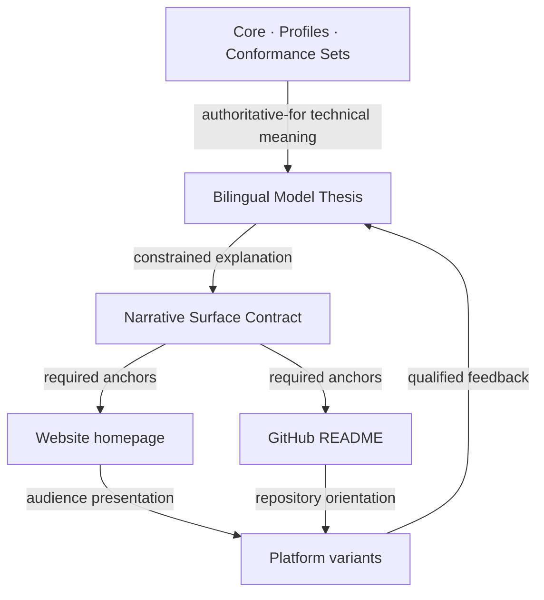

# Narrative relationship governance v0.1

- Status: Active
- Date: 2026-07-24
- Canonical language: English
- Decision: [`ADR-099`](../05_decision/ADR-099-govern-public-narrative-as-derived-surfaces.md)
- Machine-readable contract: [`narrative-surface-contract-v0.1.json`](narrative-surface-contract-v0.1.json)

## Purpose

Home World Model is expressed through specifications, a Model Thesis, the
website, GitHub READMEs, and platform-specific content. These documents serve
different readers, but they must not become different projects.

Narrative consistency means preserving the same project identity, problem,
stage, ownership claim, epistemic boundaries, ecosystem position, and invitation
to disagree. It does not mean copying the same page into every surface.

## Authority layers

| Layer | Role | May decide | Must not decide |
| --- | --- | --- | --- |
| Core, Profile, Conformance Set | Technical authority | Exact exchange meaning and conformance | Marketing position or adoption claims |
| Model Thesis | Canonical public explanation | The project wager, common ground, falsification boundary | Override normative artifacts |
| Narrative Surface Contract | Cross-surface invariant | Required public anchors and current surface relationships | Add new model semantics |
| Website homepage | Narrative presentation | Visual sequence, examples, audience pacing | Create claims absent from upstream sources |
| GitHub README | Repository orientation | Concise narrative, technical bridge, contribution path | Become an independent specification |
| Platform variants | Audience adaptation | Opening, length, examples, and CTA form | Change facts, maturity, boundaries, or authority |

English is canonical for controlled narrative claims. Simplified Chinese is a
required semantic mirror. A translation may be idiomatic, but it must preserve
the same claim, maturity, exclusions, and call to participation.

## Relationship types

- `authoritative-for`: the exact source that controls a class of meaning.
- `semantic-mirror-of`: a required language counterpart with the same revision.
- `derived-from`: a surface may compress or reorder an upstream source.
- `summarizes`: a shorter orientation that must preserve named anchors.
- `links-to`: navigation only; it transfers no authority.
- `supersedes`: replaces a prior public surface while preserving its history.

The current relationship is:

## Change protocol

1. Classify the proposed change as technical meaning, public explanation,
   surface presentation, translation, status, or CTA.
2. Change the highest applicable authority first.
3. Update the English canonical source and its Chinese mirror in one change.
4. If a controlled anchor changed, revise the Narrative Surface Contract.
5. Update website and README surfaces without forcing identical layout.
6. Run `node scripts/validate-narrative-consistency.mjs`.
7. Review maturity, ecosystem boundaries, privacy, licensing, and links.
8. Publish all affected surfaces as one coordinated narrative revision.

A surface-only typography or layout change does not require a contract revision.
A change to the lead question, project stage, ownership claim, epistemic
boundary, ecosystem boundary, or participation promise does.

## Drift policy

Publication fails when:

- a required anchor is absent from a controlled surface;
- English and Chinese express different maturity or authority;
- a surface claims consensus, adoption, production readiness, or partnership
  not established by its source;
- website or README contradicts exact normative material;
- a CTA points to a closed or nonexistent participation surface;
- a legacy draft is treated as canonical without the required language pair.

The former unpaired Chinese draft has been preserved as
`narrative-v0.1.zh-CN.md`, and the approved English canonical source now exists
at `narrative-v0.1.md`. ProductOS accepted both as
`approved_public_source` under ADR-100. The Model Thesis remains the compact
public explanation; the approved pair controls the website's long-form
narrative while exact technical artifacts retain normative authority.

## Surface responsibilities

The website begins with intuition and lived examples, then leads to the model.
The README begins with the same narrative anchors, then moves more quickly to
the technical kernel, repository map, validation, and participation. Their first
screen should feel like the same project; their later structure should serve
their respective readers.
